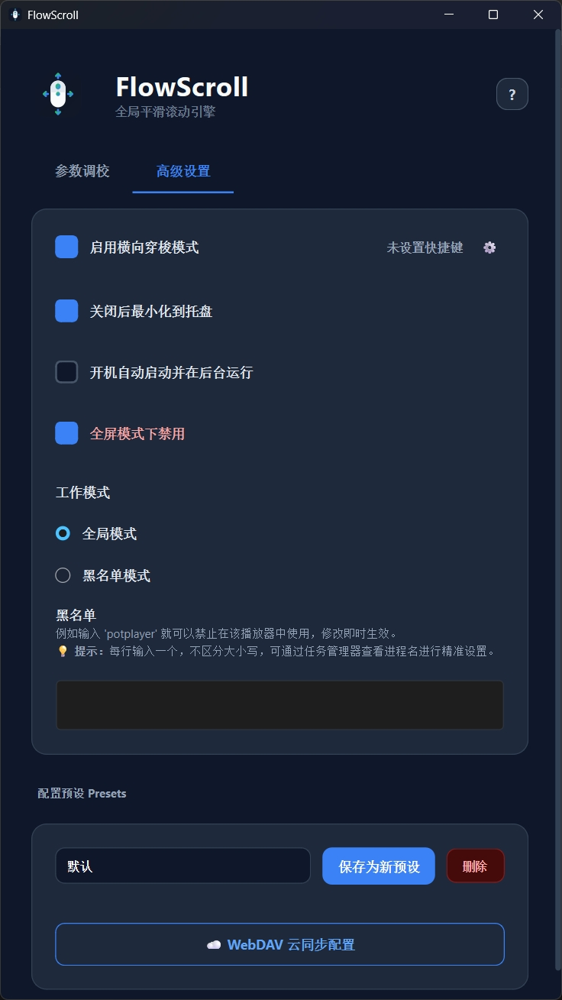

<div align="center">

#  FlowMouse 

**让你的鼠标，拥有丝滑的全局惯性滚动**

[](https://www.gnu.org/licenses/gpl-3.0)
[](https://www.python.org/downloads/)
[]()
[]()

</div>

---

## ✨ 为什么选择 FlowMouse？

你是否曾羡慕过触控板或手机屏幕上那指哪打哪、带有物理**阻尼感**的滚动体验？
传统的鼠标滚轮往往伴随着生硬的“咔哒”声，在阅读长文档或浏览网页时，视觉跳跃感极强。

**FlowMouse** 彻底改变了这一现状。
按下鼠标中键，移动鼠标，松开，即刻享受平滑滚动。
它接管了底层的输入信号，通过精心调校的物理引擎算法，将你的光标位移转化为丝滑的全局惯性滚动。

- 🚀 **全局生效**：无论是浏览器、代码编辑器还是各种复杂的桌面软件，一键即滚。
- 📐 **物理引擎**：内置可高度自定义的阻尼与加速度算法，还原最真实的物理滑行手感。
- 🔄 **横向穿梭**：支持自定义快捷键唤醒横向滚动，横向表格、时间轴从此不再是噩梦。
- 🛡️ **全屏模式禁用**：自动识别全屏游戏防止影响游戏功能，支持自定义黑名单，静默后台，不抢焦点。
- ☁️ **WebDAV 云同步**：支持配置预设的云端同步，多设备间无缝切换配置。
- 🎨 **极简设计**：全新重构的 Modern Flat 扁平化界面，高分屏完美适配。

<br>

## 🖼️ 软件界面

<div align="center">
  
  
</div>

<br>

## 📥 下载与安装

进入 [Release](https://github.com/CyrilPeng/FlowMouse/releases) 页面获取最新版本。

- **Windows 用户**: 下载 `FlowMouse_Win.exe`，双击即可运行。
- **macOS 用户**: 下载 `FlowMouse_Mac.dmg`，将其拖入 `Applications` 文件夹，并在“安全性与隐私”中赋予辅助功能权限。
- **Linux 用户**: 下载 `FlowMouse_Linux_x86.AppImage`，赋予执行权限后双击运行。

<br>

## 🛠️ 构建指南 (For Developers)

我们使用最新的下一代包管理器 `uv` 进行依赖和环境管理。

```bash
# 1. 克隆仓库
git clone https://github.com/CyrilPeng/FlowMouse.git
cd FlowMouse

# 2. 安装并同步依赖
uv sync

# 3. 运行项目
uv run main.py
```

<br>

## ⚙️ 核心配置说明

| 参数 | 描述 | 建议 |
| :--- | :--- | :--- |
| **加速度曲线** | 决定滑动距离与滚动速度之间的非线性关系。 | `1.0`-`1.5` 适合日常网页，`2.0+` 适合极长代码文件。 |
| **基础速度** | 全局滚动倍率乘数。 | 根据你的鼠标 DPI 调整。 |
| **中心死区** | 按下中键后，鼠标需要移动多少距离才开始触发滚动。 | `0.0` 为即刻触发，建议保留极小值防手抖。 |

<br>

## ☁️ WebDAV 云同步

FlowMouse 支持通过 WebDAV 协议进行配置预设的云端同步，方便在多台设备间共享你的滚动参数设置。

### 配置步骤：

1. 打开 FlowMouse 设置窗口，进入"高级系统"标签页
2. 点击"☁️ WebDAV 云同步配置"按钮
3. 填入你的 WebDAV 服务器信息：
   - **服务器地址**：WebDAV 服务器 URL（例如：`https://dav.jianguoyun.com/dav/`）
   - **用户名**：WebDAV 账号
   - **密码**：WebDAV 密码
4. 点击"测试连接"验证配置是否正确
5. 连接成功后，即可使用"上传配置"和"下载配置"功能进行同步

### 支持的 WebDAV 服务：

- 坚果云
- Nextcloud
- ownCloud
- 群晖 Synology
- 123云盘
- 以及其他支持标准 WebDAV 协议的云存储服务

<br>

## ☕ 赞赏

如果这个小工具恰好拯救了你的食指，或者为你带来了一丝桌面上的愉悦——

**“不妨，请作者喝一杯咖啡？”**

<div align="center">
  
  <p><i>（微信扫一扫）</i></p>
</div>

<br>

## 📝 许可协议

本项目采用 [GNU General Public License v3.0](https://www.gnu.org/licenses/gpl-3.0) 协议开源。
感谢所有支持与热爱开源的开发者。

<div align="center">
  <sub>Made with ❤️ by 某不科学的高数</sub>
</div>